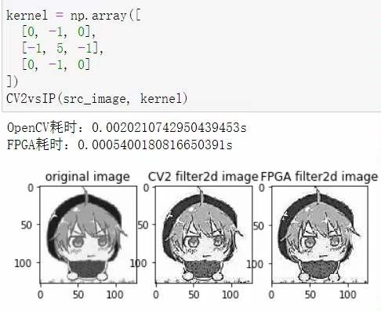
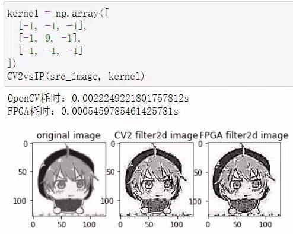
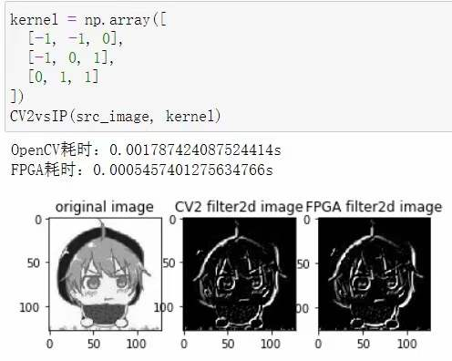

# AMD-XILINX_SummerSchool_2022_Filter2D
This repository is AMD-Xilinx Summer School 2022's CV homework Project

## Environment
Vitis HLS 2021.2、Vivado 2021.2
## jupyter
This folder includes the jupyter file to be uploaded to the board which has PYNQ architecture
## overlay
This folder includes the bitstream(.bit) and hardware handoff(.hwh) file to be uploaded to the board which has PYNQ architecture
## src
This folder includes the source code for Vitis HLS
## report
This folder includes the Vitis HLS's C Synthesis report and C/RTL Cosimulation report

## Results between CV2 and customized IP
### Sharpening an image

### Edge detection

### Emboss filter
